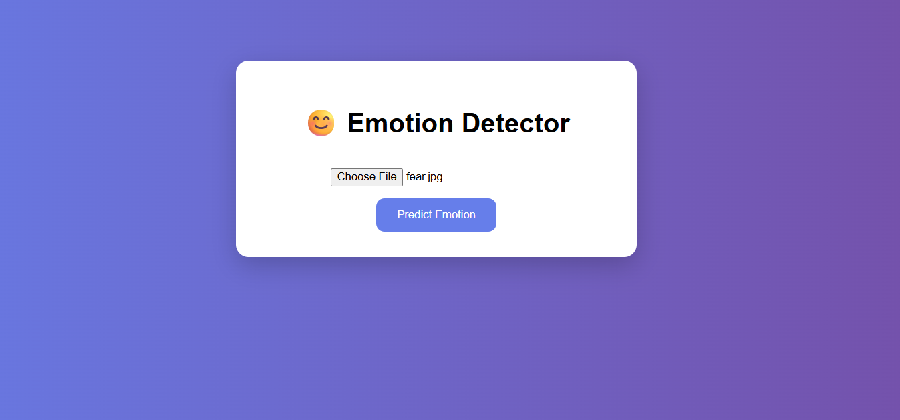

# 😊 Facial Emotion Detection Web App

This is a deep learning-based web application that detects human emotions from images using a CNN model.

---

## 🚀 Features

- Upload an image  
- Detect facial emotion  
- Display prediction with emoji 😄😢😡  
- Simple and interactive UI  

---

## 🧠 Model

- Trained on FER-2013 dataset  
- CNN architecture  
- Input: 48x48 grayscale image  

---

## 🛠️ Tech Stack

Python | TensorFlow | OpenCV | Flask | HTML | CSS  

---

## 📸 Demo

  
  

---

## ⚙️ Run Locally

```bash
git clone https://github.com/your-username/Emotion-Detection-WebApp.git
cd Emotion-Detection-WebApp
pip install flask tensorflow opencv-python numpy
python app.py
